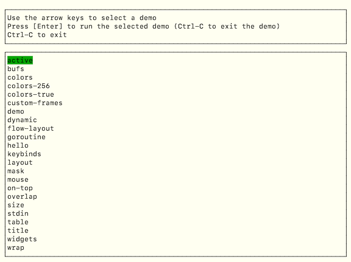

## Examples

Each of the samples in `_examples` demonstrates a specific aspect of the API.

Each can be run be alone or selected from the 'main' example.

### Build & run

```
gocui $ cd _examples/
_examples $ go build -o exam ./

_examples $ ./exam --help
usage:
./exam        : select a demo from the gui and run it
./exam <demo> : run the 'demo' argument

  where 'demo' can be one of: 
    active
    bufs
    colors
    colors-256
    colors-true
    custom-frames
    demo
    dynamic
    flow-layout
    goroutine
    hello
    keybinds
    layout
    mask
    mouse
    on-top
    overlap
    size
    stdin
    table
    title
    widgets
    wrap

```

### Select a demo through the gui



